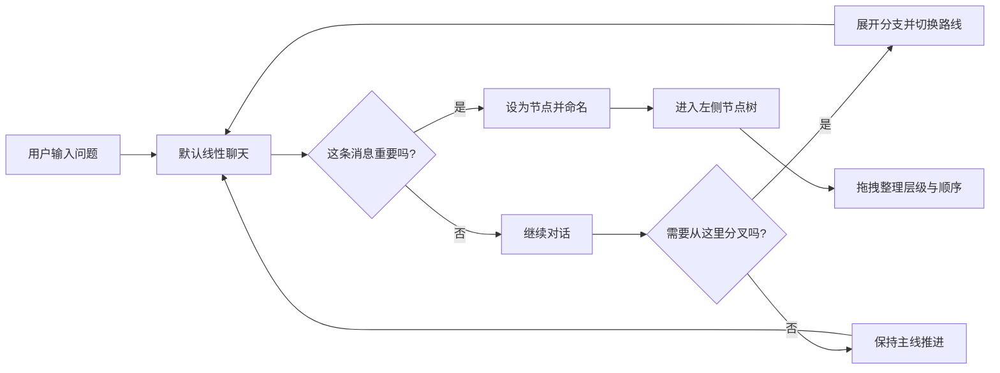
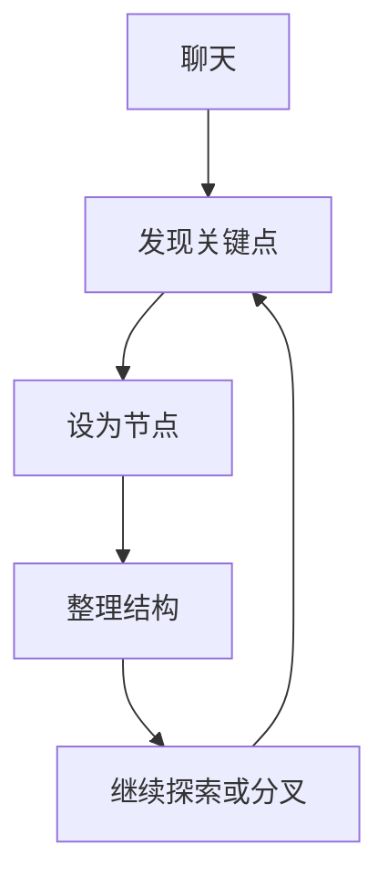

# 言枢 YanShu

<div align="center">

**言为枢，心为机**

把 AI 对话从一条时间线，变成一个可组织、可分支、可回溯的思维工作台。

[](https://opensource.org/licenses/MIT)
[](https://www.python.org/)
[](https://reactjs.org/)
[](https://fastapi.tiangolo.com/)

</div>

---

## 它是什么

YanShu 是一个面向深度思考场景的 AI 对话工具。

普通聊天产品擅长“连续问答”，但不擅长处理这些真实需求：

- 讨论到一半，想从某条消息另开一条路线
- 想把真正重要的消息提取出来，整理成结构
- 想保留探索过程，但又不想让整棵树被每一句话塞满
- 对话已经很深，想快速回到上游节点继续推演

YanShu 的做法是：

- 默认保持自然的线性聊天
- 只有在你主动需要时，才把消息提升为节点
- 节点树负责“组织重要内容”，消息链路负责“保留真实上下文”

一句话概括：

> 先像聊天一样思考，再像知识结构一样整理。

---

## 它在解决什么问题

普通 AI 聊天有一个天然限制：

- 聊到后面，上文越来越长，回看越来越难
- 想从某个关键点岔开讨论，只能靠复制粘贴重新提问
- 有价值的内容和随手试探的内容混在一起，很难整理
- 一旦话题很多，整段对话会退化成一条很长的时间流

这个问题可以很直观地表示成：

```text
传统聊天

问题 A -> 追问 B -> 修正 C -> 新方向 D -> 回到 B -> 再开 E -> ...

所有内容都被压成一条线，回溯、分叉、整理都很别扭
```

而 YanShu 想做的是：

```text
YanShu

起点 A
├── 路线 B：继续主线
│   ├── 关键节点 B1
│   └── 分支 B2
└── 路线 C：换一个角度探索
    ├── 关键节点 C1
    └── 结论 C2
```

核心不是“把聊天变复杂”，而是让复杂思考终于有地方安放。

---

## 产品逻辑一图看懂



---

## 当前版本的核心体验

### 1. 默认线性聊天

进入应用后可以直接像普通 AI 聊天一样输入，不会每发一条消息就自动生成一个节点。

这让主对话保持轻量，也避免左侧树迅速膨胀。

### 2. 手动把关键消息设为节点

当某条消息值得被记录、命名、组织时，可以主动把它“设为节点”。

- 支持自定义节点标题
- 支持之后重命名
- 节点会进入左侧结构树

### 3. 在消息内部展开分支

每条有子分支的消息，右侧都可以展开分支列表。

- 点击箭头展开当前消息的可选分支
- 在消息下方查看各个子路线
- 点击任意分支，直接切换到那条路径继续对话

### 4. 左侧节点树是可操作的结构层

左侧不是“所有消息列表”，而是“你主动整理出来的节点结构”。

- 支持节点重命名
- 支持拖拽排序
- 支持拖拽调整父子层级
- 支持左右拉伸侧栏宽度

### 5. 对话链路和结构树分离

这是当前版本一个很关键的设计点。

- 对话链路保留真实上下文关系
- 左侧节点树保留人工整理后的结构关系

这样拖动左侧节点时，不会破坏真实的聊天路径。

---

## 为什么这种结构更自然

YanShu 不是要求用户一开始就“建树”，而是遵循一个更贴近真实思考的过程：

1. 先连续讨论，让问题自然展开
2. 遇到关键内容，再手动提炼成节点
3. 对重要节点做结构化整理
4. 在需要时从任意位置分叉继续探索

这个过程可以简单理解为：



---

## 为什么这样设计

如果系统默认把每一句话都变成节点，结构会很快失控。

YanShu 现在选择了一种更克制的方式：

- 把“聊天”留在中间
- 把“整理”放在左边
- 把“详情和补充信息”放在右边

它更像一个思考工作台，而不是一个自动长满节点的对话树。

---

## 界面结构

```text
┌──────────────────────────────────────────────────────────────┐
│ Header: 新建 / 搜索 / 主题 / 设置                             │
├────────────────┬──────────────────────────────┬──────────────┤
│ 左侧节点树       │ 中间聊天区                      │ 右侧详情面板   │
│                │                              │              │
│ - 手动节点结构   │ - 当前激活路径                  │ - 标题        │
│ - 拖拽排序       │ - 分支展开                     │ - 内容        │
│ - 层级整理       │ - 设为节点                     │ - 标签        │
│ - 宽度拉伸       │ - 继续聊天                     │ - 分支信息     │
└────────────────┴──────────────────────────────┴──────────────┘
```

对应的角色分工是：

- 左侧：放“整理过的结构”
- 中间：放“当前正在发生的对话”
- 右侧：放“当前节点的补充信息”

---

## 已有功能

- 线性聊天输入与上下文延续
- 手动创建节点
- 自定义节点标题
- 节点重命名
- 节点拖拽排序与层级调整
- 左侧节点栏可拉伸
- 消息分支展开与切换
- 面包屑路径导航
- 全局搜索
- 节点标签编辑
- 右侧详情面板
- 深色 / 浅色主题
- 对话导入 / 导出
- 上下文模式切换：`full` / `summary` / `cold`

---

## 技术栈

| 层级 | 技术 |
|---|---|
| 前端 | React 18 + TypeScript + Vite |
| 状态管理 | Zustand |
| 图形交互 | `@xyflow/react` |
| 图标 | `lucide-react` |
| 样式 | Tailwind CSS |
| 后端 | FastAPI |
| 数据存储 | SQLite |
| AI 接入 | DeepSeek API（通过 OpenAI SDK 调用） |

---

## 项目结构

```text
YanShu/
├── frontend/
│   ├── src/
│   │   ├── components/
│   │   ├── stores/
│   │   └── ...
│   └── package.json
├── backend/
│   ├── database/
│   ├── models/
│   ├── routes/
│   ├── services/
│   ├── main.py
│   └── requirements.txt
├── database/
├── docs/
├── SPEC.md
└── README.md
```

---

## 快速开始

### 环境要求

- Python 3.11+
- Node.js 18+
- pnpm
- DeepSeek API Key

### 1. 克隆项目

```bash
git clone https://github.com/Vead-YI/YanShu.git
cd YanShu
```

### 2. 配置后端环境变量

```bash
cd backend
cp .env.example .env
```

至少需要配置：

```bash
DEEPSEEK_API_KEY=your-api-key
```

### 3. 启动后端

```bash
cd backend

python -m venv venv
source venv/bin/activate
pip install -r requirements.txt

uvicorn main:app --reload --port 8000
```

### 4. 启动前端

```bash
cd frontend

pnpm install
pnpm dev
```

### 5. 打开应用

- 前端：[http://localhost:5173](http://localhost:5173)
- 后端文档：[http://localhost:8000/docs](http://localhost:8000/docs)

---

## 推荐使用方式

### 先聊，再整理

先把中间聊天区当成正常对话流来用，不要急着建结构。

### 遇到关键点，再设为节点

当一条消息足够重要时：

1. 点击“设为节点”
2. 输入一个清晰标题
3. 它会进入左侧节点树

### 在左侧整理结构

对于已经提取出来的节点：

- 拖拽改变顺序
- 拖拽到别的节点下，形成层级
- 重命名，让结构更清楚

### 用分支继续探索

如果某条消息存在多个方向：

- 点击消息右侧箭头展开分支
- 直接选择要继续的路线
- 保留主线，同时探索侧支

---

## 适合什么场景

### 学术研究

适合把一个大问题拆成多个可探索的小方向，再把关键结论沉淀成节点。

### 复杂写作

适合在写文章、做提纲、打磨论证时，同时保留主线和多个备选表达。

### 编程与调试

适合记录不同排查路径、保留失败方案，并把最终有效结论提炼出来。

### 长链路思考

适合那些“一次对话不够、需要反复来回推演”的问题。

---

## 开发说明

### 本地数据库

默认数据库文件位于：

`database/yanshu.db`

### API 文档

后端启动后可访问：

- [http://localhost:8000/docs](http://localhost:8000/docs)
- [http://localhost:8000/redoc](http://localhost:8000/redoc)

---

## 当前阶段

YanShu 目前已经具备完整的本地可用闭环，但仍然处在快速演进阶段。

接下来很值得继续增强的方向包括：

- 更强的分支对比视图
- 更成熟的上下文压缩策略
- 更灵活的节点创建方式
- 更强的知识组织与检索能力
- 协作与分享能力

---

## 相关文档

- [SPEC.md](./SPEC.md)
- [docs/API.md](./docs/API.md)

---

## 许可证

MIT

---

## 作者

**Zuyang Li**

[GitHub: Vead-YI](https://github.com/Vead-YI)

---

<div align="center">

让思维自由分叉，也能被重新整理。

</div>
